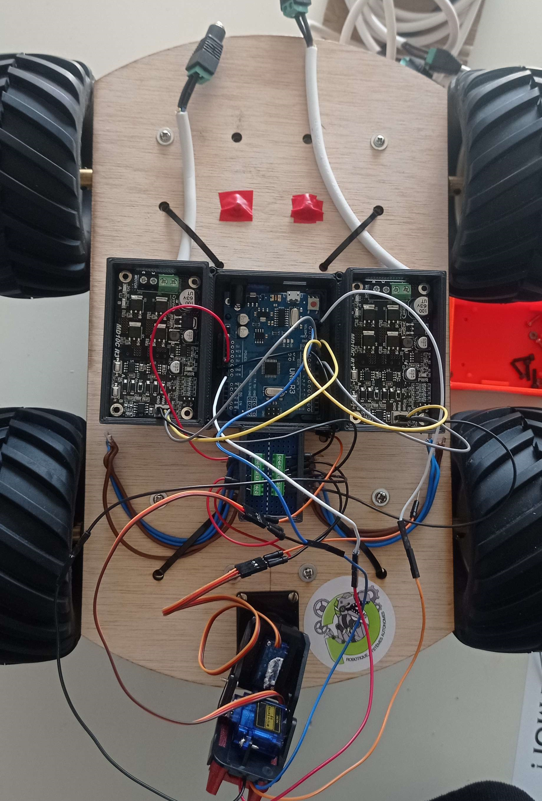

# Rapport de séance du mardi 08/02/2023

### Goal of the session: Remodel the electronic cards case 

 

J'ai donc décidé de faire un boitier permettant de stocker toutes les cartes électroniques pour optimiser la place sur le robot et mieux manager les câbles tout en évitant des problème de court circuit qui pourrait apparaitre. Je vais donc modéliser en 3D une structure qui permet d'accueillir la carte arduino, les 2 cartes de commande de moteur et la carte d'alimentation.

 

Pour cela j'ai repris le modèle du boitier que j'avais utilisé pour l'arduino et j'en ai créer 2 autres pour les autres composants.

 

J'ai ensuite assemblé tout les éléments autour du boitier arduino (dans un souci d'esthétisme) en prenant soin de surélever ceux-ci pour faciliter le passage des câble en dessous.

 

Après impression 3D en PLA on obtient ceci :

 

Et après l'avoir monté sur le robot on a :

